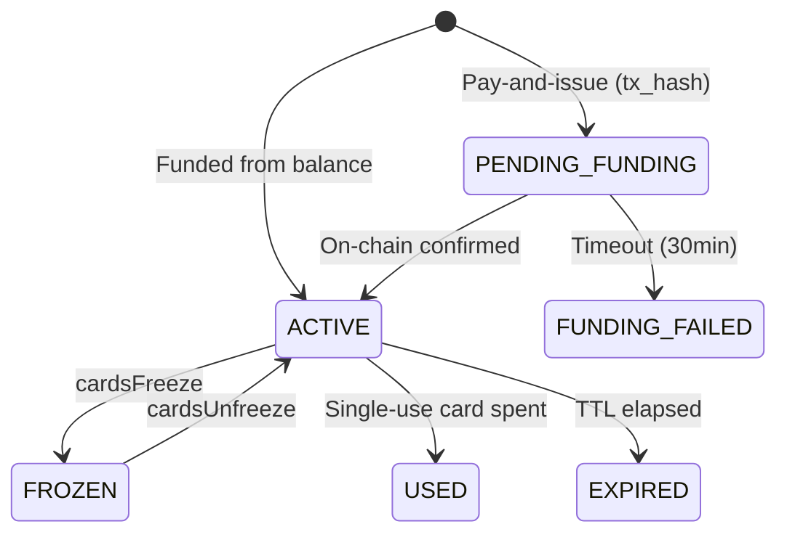

## Overview

Cards are the core primitive. Each card is a virtual payment instrument backed by your USDC treasury balance. Agents use cards to pay for APIs, services, and resources.

## Card lifecycle



## Issue a card

<CodeGroup>
```typescript TypeScript
const card = await mag3nt.cards.cardsCreate({
  purpose: "Research Agent",
  limitAmount: 50,        // Max spend in USDC
  network: "eip155:8453", // Base
  asset: "USDC",
  singleUse: false,       // Reusable
  expiresIn: 24,          // Hours (0 = never)
});
```
```python Python
card = sdk.cards.cards_create(
    purpose="Research Agent",
    limit_amount=50,
    network="eip155:8453",
    asset="USDC",
    single_use=False,
    expires_in=24,
)
```
</CodeGroup>

## Bulk issuance

Create up to 1,000 cards atomically:

```typescript
const batch = await mag3nt.cards.cardsBulkCreate({
  cards: [
    { purpose: "Agent Alpha", limitAmount: 25 },
    { purpose: "Agent Beta", limitAmount: 25 },
    { purpose: "Agent Gamma", limitAmount: 50 },
  ],
  network: "eip155:8453",
  asset: "USDC",
});
// All-or-nothing: if total exceeds balance, none are created
```

## Spending controls

### MCC locks

Restrict which merchant categories a card can pay:

```typescript
await mag3nt.cards.cardsUpdateControls(cardId, {
  mccLocks: "5411,5812", // Only grocery and restaurants
});
```

### Freeze / unfreeze

Instantly block all transactions on a compromised card:

```typescript
await mag3nt.cards.cardsFreeze(cardId);
// Card is immediately blocked — no payments can process

await mag3nt.cards.cardsUnfreeze(cardId);
// Card is restored to ACTIVE
```

## Audit trail

Every transaction is recorded with full metadata:

```typescript
const txns = await mag3nt.cards.cardsListTransactions(cardId);
for (const txn of txns.transactions) {
  console.log(`${txn.amount} USDC to ${txn.merchant} via ${txn.protocol}`);
}
```

## Sandbox & testnet

mag3nt uses **network-based** environment isolation — no separate test API keys needed. Issue a card on a testnet network to activate sandbox mode:

<CodeGroup>
```typescript TypeScript
const testCard = await mag3nt.cards.cardsCreate({
  purpose: "Testing Agent",
  limitAmount: 100,
  network: "eip155:84532",  // Base Sepolia = sandbox
  asset: "USDC",
});
```
```python Python
test_card = sdk.cards.cards_create(
    purpose="Testing Agent",
    limit_amount=100,
    network="eip155:84532",  # Base Sepolia = sandbox
    asset="USDC",
)
```
</CodeGroup>

### How it works

| Card network | Environment | Settlement |
|---|---|---|
| `eip155:8453` (Base) | `production` | Real USDC settled on-chain |
| `eip155:84532` (Base Sepolia) | `sandbox` | Balance deducted, **no on-chain settlement** |

Every payment response includes an `environment` field:

```json
{
  "success": true,
  "environment": "sandbox",
  "payment_header": {
    "X-mag3nt-Environment": "sandbox"
  }
}
```

<Warning>
  Sandbox transactions deduct from your card balance just like production, but they are **never settled on-chain**. The settlement engine permanently skips all `SANDBOX` transactions.
</Warning>

### Same API key, same endpoints

Your API key works for both environments. The card's funding network is the boundary — not the key, not the endpoint. A single account can have both mainnet and testnet cards simultaneously.
